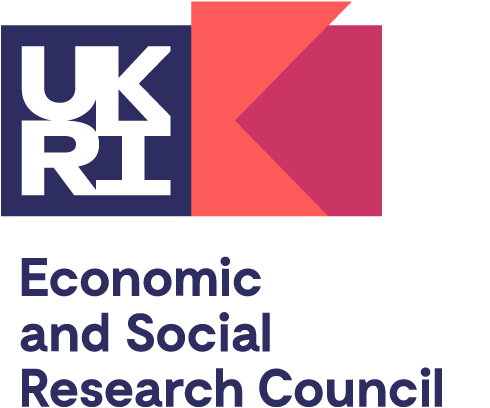

  
  &nbsp;&nbsp;&nbsp;&nbsp;&nbsp;
  

<h1 align="center" style="font-size: 48px; margin: 20px 0;">🐝 Play the CircuBee Circular Token Challenge 🐝</h1>
<h2 align="center" style="font-size: 36px; margin: 10px 0;">🎪 ESRC Festival of Social Science 🎪</h2>

  

<em>A live, interactive decision game about building a circular economy business</em>

<h2 align="center" style="font-size: 32px; padding: 20px; background-color: #f0f0f0;">✨ FREE TO JOIN — BOOKING REQUIRED VIA EVENTBRITE ✨</h2>

| 📅 Date | ⏰ Round 1 | ⏰ Round 2 | 📍 Location | 🎟️ Places |
|---|---|---|---|---|
| **Tuesday 21 October** | **1:00 PM – 2:00 PM** | **3:00 PM – 4:00 PM** | **Salford Museum and Art Gallery, Manchester** | **15 places per round** |

<h2 align="center" style="font-size: 28px;">🎁 Voucher Incentive</h2>

<blockquote style="font-size: 18px; text-align: center; padding: 15px;">
  <strong>Stay for the group activity and claim a £10 Amazon voucher!</strong> 
  Take part in the token challenge, then join our short group activity afterwards to be entered for your voucher.
</blockquote>

<h2 align="center" style="font-size: 28px; margin-top: 30px;">📱 Scan to Book Your Place</h2>

  

Scan this QR code to open the Eventbrite booking page — 15 spaces available per round.

🔗 <strong><a href="https://www.eventbrite.co.uk/e/circubee-can-going-green-save-you-money-tickets-1999676880379">CircuBee: Can Going Green Save You Money?</a></strong>

<h2 align="center" style="font-size: 28px; margin-top: 30px;">🚀 How It Works</h2>

<ol style="font-size: 18px; line-height: 1.8;">
<li>📲 Scan the QR code or visit the Eventbrite link to book your free place — choose Round 1 (1–2pm) or Round 2 (3–4pm), 15 places per round.</li>
<li>🚶 Come to Salford Museum and Art Gallery, Manchester on 21 October, at your booked round time.</li>
<li>🎮 Play the CircuBee token challenge as a local business decision-maker.</li>
<li>🏆 Stay for the short group activity afterwards for your chance to win a £10 Amazon voucher.</li>
</ol>

  🌍 <strong>All welcome — free to join, booking required via Eventbrite.</strong>  
  For more information about the game, visit <a href="https://kate0543.github.io/circubee-token-game/">kate0543.github.io/circubee-token-game</a>

